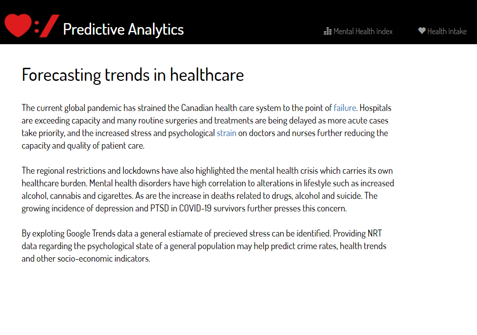
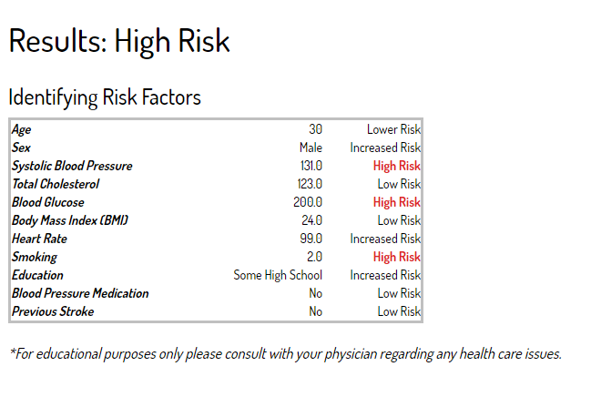
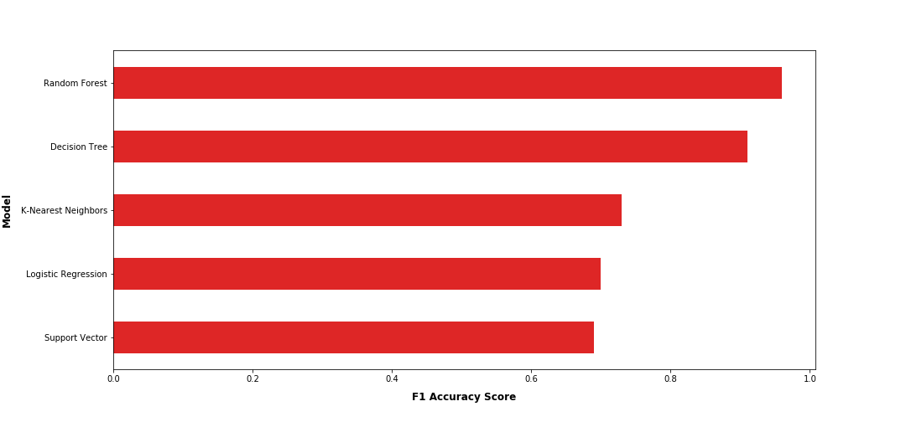

# Coronary Heart Disease (CHD) Predictor

Deployed website including interactive health intake form to predict 10 year risk level for developing coronary heart disease.

Final project for University of Toronto SCS Data Analytics Boot Camp program. 
*December update: Webpage now includes mental distress forecasting project (in development)*

## Data sources
* Kaggle: [Framingham heart study data](https://www.kaggle.com/amanajmera1/framingham-heart-study-dataset)
## Tools/Packages
* HTML
* CSS
* Python
* TensorFlow
* Flask

## How to use
* Active link: https://predictivehealth.herokuapp.com/ 

## Key findings/Highlights

 
K-Nearest neighbors was chosed for the decision model as it tested better in pracitcal testing over random forest and decision tree models.
  

## Applications
Healthcare is currently in a state of crisis around the world. By identifying high risk candidates of heart disease in advance we can monitor and implement early intervention strategies to reduce mortality due to heart disease. 
